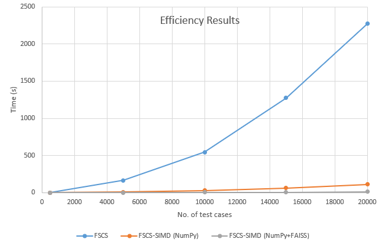

# FSCS-SIMD
Code for our paper:
[FSCS-SIMD: An efficient implementation of Fixed-Size-Candidate-Set adaptive random testing using SIMD instructions (Research Paper)](http://2020.issre.net/research-accepted-papers), Accepted in [The 31st International Symposium on Software Reliability Engineering (ISSRE 2020)](http://2020.issre.net/)
 
Description: A method to enhance the efficiency of FSCS-ART throught SIMD and Parallelization.

### Version 2.0 Updates

+ Maximum use of CPU cores with [FAISS](https://github.com/facebookresearch/faiss) library which is [highly optimized for SIMD](https://speakerdeck.com/matsui_528/cvpr20-tutorial-billion-scale-approximate-nearest-neighbor-search?slide=13). FAISS also has GPU version for further speed-up. However, we have used CPU-only version to keep the validity of comparisons. 

+ Further optimizations in code: FSCS original version, Random test case generator

### Evaluation
**Machine:** Dell Latitude E6430, Intel Core i5-3320M CPU @ 2.60GHz, 2 Cores, 4 Logical Processors, 6GB RAM running on Ubuntu 20.04 LTS 64-bit with Python 3.7 as the development environment. Ubuntu is selected because FAISS setup is easily supported on Linux.

#### CPU Core Usage:

##### FSCS-SIMD using NumPy
Although NumPy provided vectorization and parallelization ([link](https://stackoverflow.com/questions/44944367/are-numpys-basic-operations-vectorized-i-e-do-they-use-simd-operations)). However, parallelization regarding CPU core usage was not upto the mark. As shown following most of the processing was sitting on a single CPU core:
.png "Title")

##### FSCS-SIMD using NumPy+FAISS
The below picture shows that all the CPU cores are used to achieve maximum level of parallelization. All 4 CPUs are being used:
.png "Title")

#### Results
In this way, we managed to reduce computational overhead of FSCS further:

